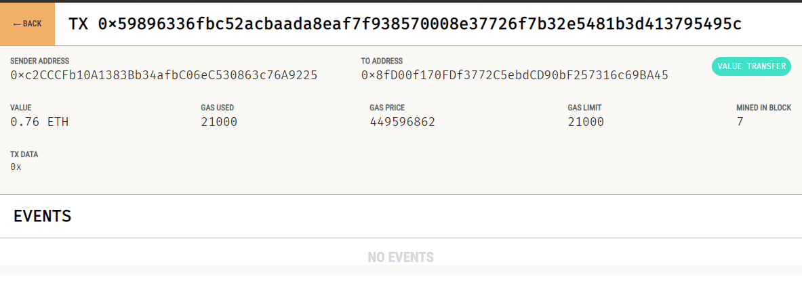

# KryptoJobs2Go

KryptoJobs2Go is used to find fintech professionals from a list of candidates, hire them, and then pay them. 
The purpose is to enable the customers to instantly pay their hired fintech professionals with cryptocurrency.

## Valid transaction

## Ganache account

## Transaction

